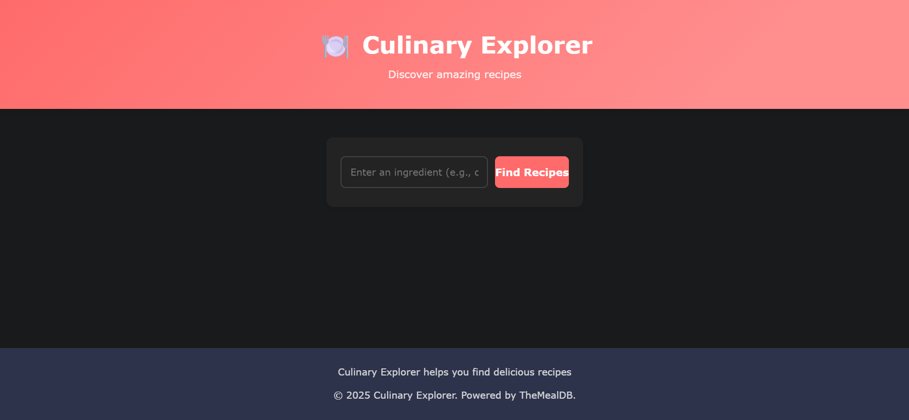
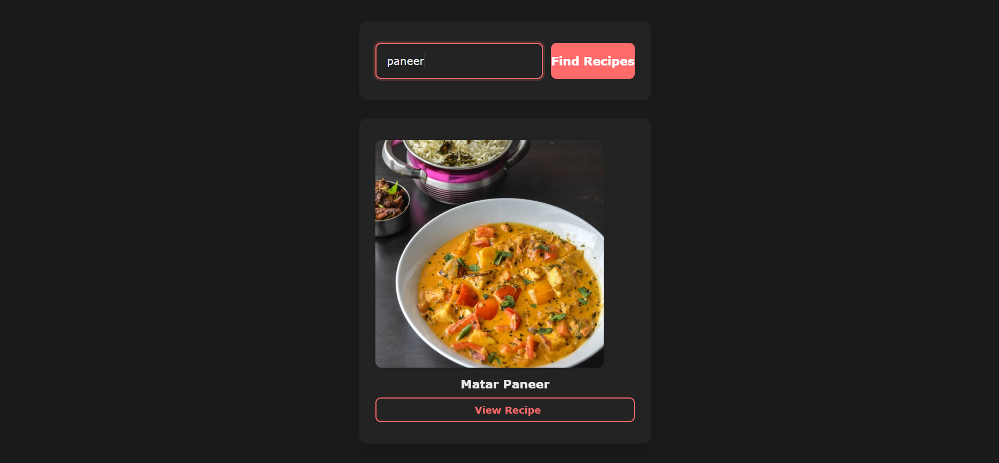

# 🍽️ Culinary Explorer


A beautiful and responsive web application that helps you discover delicious recipes based on ingredients you have on hand. Built with modern JavaScript and powered by TheMealDB API.

## ✨ Features

- **Ingredient-Based Search**: Find recipes based on ingredients you have
- **Detailed Recipes**: View comprehensive recipe information including ingredients, measures, and step-by-step instructions
- **Fast Performance**: Server-side caching for improved API response time

## 📷 Screenshots

<div align="center">
  <table>
    <tr>
      <td align="center">
        <strong>Search Screen</strong><br>
        
      </td>
      <td align="center">
        <strong>Recipe Results</strong><br>
        
      </td>
    </tr>
    <tr>
      <td align="center" colspan="2">
        <strong>Detailed Recipe View</strong><br>
        
      </td>
    </tr>
  </table>
</div>

### Installation

1. Clone the repository
   ```
   git clone https://github.com/Aaryan-Sharma-5/Receipe-Finder.git
   ```

2. Install dependencies
   ```
   npm install
   ```

3. Start the server
   ```
   npm start
   ```

4. Open your browser and navigate to:
   ```
   http://localhost:5000
   ```

## 🔧 Tech Stack

- **Frontend**: HTML5, CSS3, JavaScript
- **Backend**: Node.js, Express
- **API**: [TheMealDB](https://www.themealdb.com/)

## 🧰 API Documentation
The application uses TheMealDB API with the following endpoints:

- **Search by ingredient**: `/recipes?ingredient=egg`
  - Returns a list of recipes containing the specified ingredient

- **Get recipe details**: `/meal/{id}`
  - Returns detailed information about a specific recipe

## 🛠️ Performance Optimizations

- **Cache Management**: Server-side caching of API responses with 30-minute expiration
- **Error Handling**: Comprehensive error handling for API failures
- **Loading States**: Visual feedback during data fetching operations

---

<div align="center">
  <p>Made with ❤️ by Aaryan</p>
</div>
