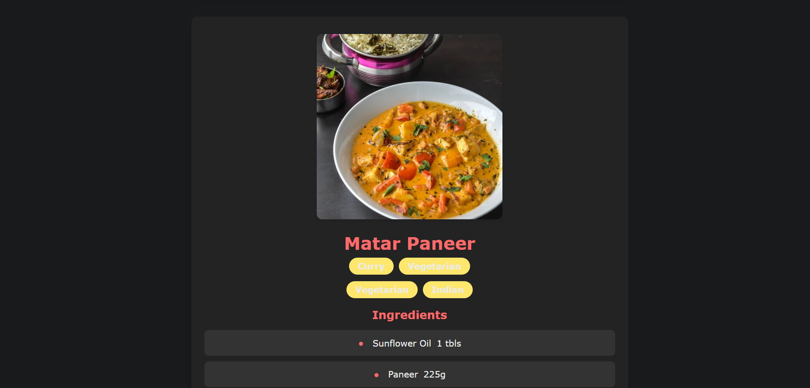

# 🍽️ Culinary Explorer


A beautiful and responsive web application that helps you discover delicious recipes based on ingredients you have on hand. Built with modern JavaScript and powered by TheMealDB API.

## ✨ Features

- **Ingredient-Based Search**: Find recipes based on ingredients you have
- **Detailed Recipes**: View comprehensive recipe information including ingredients, measures, and step-by-step instructions
- **Fast Performance**: Server-side caching for improved API response time
- **Responsive Design**: Optimised for both mobile and desktop viewing experiences

## 📷 Screenshots

<div align="center">
  <table>
    <tr>
      <td align="center">
        <strong>Search Screen</strong><br>
        
      </td>
      <td align="center">
        <strong>Recipe Results</strong><br>
        
      </td>
    </tr>
    <tr>
      <td align="center" colspan="2">
        <strong>Detailed Recipe View</strong><br>
        
      </td>
    </tr>
  </table>
</div>

## 🚀 Live Demo

Visit the live application:
- [Culinary Explorer on Vercel](https://receipe-finder-dun.vercel.app/)
- API Endpoint: [API Backend on Railway](https://receipe-finder-production.up.railway.app/)

## 🔧 Tech Stack

### Frontend
- **Languages**: HTML5, CSS3, Vanilla JavaScript
- **Deployment**: Vercel

### Backend
- **Runtime**: Node.js
- **Framework**: Express.js
- **Features**: API caching, CORS support
- **Deployment**: Railway

### External API
- [TheMealDB API](https://www.themealdb.com/api.php) - Free recipe database

## 🛠️ Installation & Setup

### Prerequisites
- Node.js 16 or higher
- npm or yarn

### Local Development

1. Clone the repository
   ```bash
   git clone https://github.com/Aaryan-Sharma-5/Receipe-Finder.git
   cd Receipe-Finder
   ```

2. Install dependencies
   ```bash
   npm install
   ```

3. Start the development server
   ```bash
   npm run dev
   ```
   
4. Open your browser to `http://localhost:5000` or open `Frontend/index.html` directly
   ```bash
   npm start
   ```

### Deployment Configuration

The project includes configuration files for deployment:
- `vercel.json` for Vercel deployment
- Environment setup for Railway deployment
  
## 📡 API Documentation

The application's backend provides these endpoints:

- **Search by ingredient**: `/api/recipes?ingredient=chicken`
  - Returns a list of recipes containing the specified ingredient

- **Get recipe details**: `/api/meal/{id}`
  - Returns detailed information about a specific recipe by ID
  
## 🛠️ Performance Optimizations

- **API Caching**: Server-side caching with 30-minute expiration to reduce external API calls
- **Error Handling**: Comprehensive error handling for API failures and network issues
- **Loading States**: Visual feedback during data fetching operations
- **Responsive Images**: Optimized images for various screen sizes

---

<div align="center">
  <p>Made with ❤️ by Aaryan</p>
</div>
